# ✅ @o3 Engineering Specification

## 🔗 High-Level System Overview

**Goal:** Automate the purchase of Amazon Pay vouchers in multiple ₹1500 transactions to maximize Amex MRCC/Gold Card rewards, while handling:

- Multi-step, asynchronous flows
- OTP waits from multiple services (Amex, Gyftr, Amazon)
- Payment via browser automation
- Voucher redemption into Amazon account
- Progress updates in the UI

**Architecture stack:**

- **Frontend:** Next.js (React) + Supabase Realtime subscriptions
- **Backend workflow orchestration:** Inngest
- **Backend state & user progress:** Supabase Postgres
- **Automation tooling:** Browserbase + Stagehand
- **Authentication:** Supabase Auth
- **Infrastructure host:** Vercel

---

## 🎨 Frontend

### 1. Start Purchase Screen

Inputs:

- Card Type (MRCC / Gold)
- No. of transactions (e.g. `4`)
- Transaction amount (e.g. `₹1500`)

On submit:

- Call **Next.js API route** → triggers Inngest event

### 2. Progress UI

- Subscribe to job progress via Supabase Realtime.
- Display:
  - Current step (e.g. “Logging into Gyftr…”)
  - Progress bar (0–100 %)
  - Any error messages
- Listen to DB columns:
  - `status`
  - `progress`
  - `message`

### 3. Completion / Error UI

- Final success summary: how many transactions completed & any vouchers still pending manual redemption.

---

## 🔧 Backend

### 1. Next.js API Route (`/api/start-job`)

Purpose:

- Receive **Start Purchase** request from frontend
- Insert a row in `jobs` table
- Fire Inngest event `rm/bulk-purchase.requested`

Steps:

```ts
const jobId = crypto.randomUUID();

await supabase.from("jobs").insert({
  id: jobId,
  user_id: authUser.id,
  status: "queued",
  progress: 0,
  message: "Queued job",
});

await inngest.send({
  name: "rm/bulk-purchase.requested",
  data: { jobId, userId: authUser.id, qty, amount, cardType },
});

return NextResponse.json({ jobId });
```

### 2. Supabase Schema

```sql
create table public.jobs (
  id         uuid primary key,
  user_id    uuid references auth.users,
  status     text,
  progress   int,
  message    text,
  updated_at timestamptz default now()
);

alter table jobs enable row level security;

create policy "Users read own jobs"
  on jobs for select
  using (auth.uid() = user_id);
```

Additional tables:

- `sms_otps` — store inbound OTP messages
- `voucher_codes` — store issued voucher codes per job

### 3. Inngest Durable Workflow (`rm/bulk-purchase.requested`)

#### NEW Step List

1. **Pre-validation (fail fast)**
   - Check Gyftr inventory for the requested `amount`.
   - If inventory insufficient → `failed`, exit.

2. **Parallel #1 – Logins**
   - Login Gyftr (Rewards Multiplier)
   - Login Amazon (create Browserbase session)

3. **Parallel #2 – Limit probe**
   - Generate **N** payment links **simultaneously** (one per requested transaction).
   - If **any** returns **“Exceeded limit”**:
     - Mark job `failed` (`"User monthly limit exceeded"`).
     - Abort workflow (no retries).

4. **Sequential Purchases (loop N)** — runs only if all links succeed
   - Pay link via Browserbase automation
   - Fill card → trigger OTP → wait OTP → submit OTP
   - Wait for Gyftr voucher(s) to be issued
   - Redeem voucher(s) in Amazon using existing browser context
   - Update progress for each iteration

5. **Finalisation**
   - `setProgress(jobId, { status: "done", progress: 100, message: "All vouchers redeemed successfully" })`

#### Retry & Error Policy

- All steps: max 3 retries **except** the _limit-probe_ step (no retry on "Exceeded limit").
- On unrecoverable error: mark job `failed` with last error message.

### 4. OTP Event Flow

When an OTP arrives (e.g. via SMS-forwarding service):

```ts
await inngest.send({
  name: "otp/received",
  data: { userId, otpText, originating_service, context_id },
});
```

Durable steps use `waitForEvent()` to unblock.

### 5. Progress Updates Helper

```ts
await setProgress(jobId, {
  status: "paying",
  progress: 70,
  message: "Processing payment link #2",
});
```

Frontend subscribes to changes on `jobs` via Supabase Realtime.

---

## 🤖 Implementation Details

Libraries:

- Inngest JS SDK
- Supabase JS Client
- Browserbase + Stagehand SDK
- Next.js App Router

Environment variables:

- `SUPABASE_URL`
- `SUPABASE_SERVICE_ROLE_KEY`
- `INNGEST_SIGNING_KEY`
- `BROWSERBASE_API_KEY`

---

## ✅ Core API

### Start Purchase

```
POST /api/start-job
{
  "cardType": "MRCC",
  "qty": 4,
  "amount": 1500
}

→ { "jobId": "<uuid>" }
```

---

## ⚠️ Error Handling Summary

- Any Inngest step may throw; automatic retries (max 3) except for limit-probe.
- On final failure: `setProgress(jobId, { status: "failed", message })`.
- Partial progress is always saved. If vouchers issued but not redeemed, notify user for manual redemption.

---

## ✅ Deliverables for AI Agent

- Frontend React components (Start Purchase form, Progress bar, Final status page)
- Supabase schema migration
- API route `/api/start-job`
- Inngest workflow implementing the above steps
- Supabase Realtime hook in frontend
- Testing stubs (mock OTPs, stubbed browser automation)

---

## 🎯 Visual Workflow Diagram

```mermaid
graph TD
    A[Frontend] -- "POST /api/start-job" --> B{Next.js API};
    B -- "Send Inngest event" --> C(Inngest Workflow);
    C --> D{"1. Pre-validate Inventory"};
    D -- "Inventory OK" --> E["2. Parallel Logins"];
    D -- "No Inventory" --> F[❌ Fail Job];
    subgraph E [ ]
        direction LR
        E1["Login Gyftr"]
        E2["Login Amazon"]
    end
    E --> G["3. Parallel Limit Probe"];
    subgraph G [ ]
        direction LR
        G1["Create Link 1"]
        G2["Create Link 2"]
        G3["..."]
        G4["Create Link N"]
    end
    G -- "Any link fails ('Limit Exceeded')" --> F;
    G -- "All links OK" --> H{"4. Sequential Purchases"};
    H --> I{Loop N times};
    I -- "For each link" --> J["Pay → Redeem"];
    J --> I;
    I -- "Loop finished" --> K[✅ Finalize Job];
    K -- "Update DB" --> L(Supabase);
    L -- "Realtime Push" --> A;
```



---

### Why Inngest?

- Multiple waits (OTPs, voucher issuance)
- Workflow > 60 s
- Automatic retries & durability
- Clear logs + replay

Inngest + Supabase is therefore an ideal fit.
